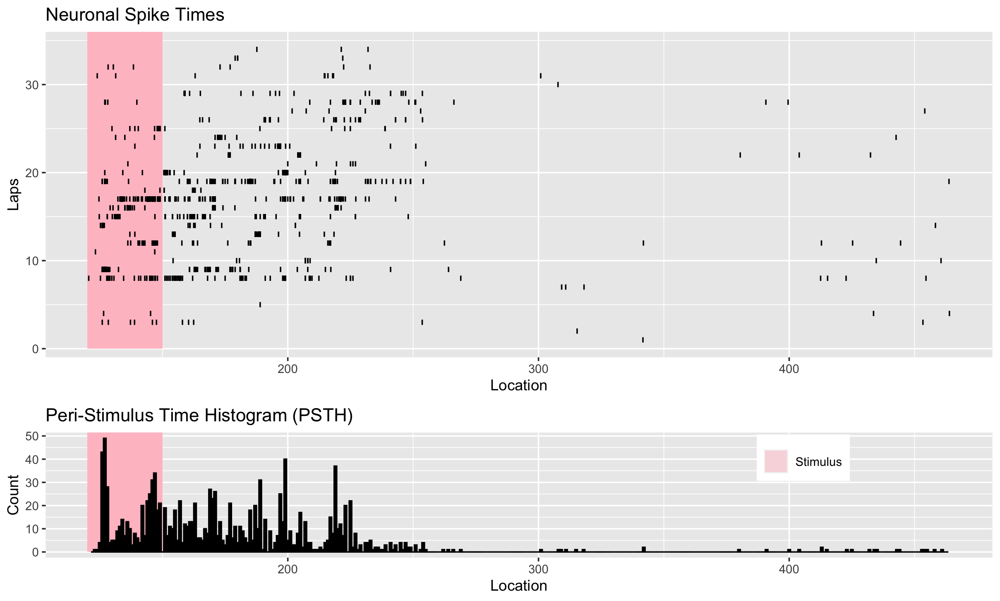

<!-- README.md is generated from README.Rmd. Please edit that file -->

# Explore

The goal of explore is to automatically generate visualizations given variables in a dataset across the disciplines statistics, geography, and neuroscience. It generates interactive graphs such scatterplots and boxplots for statistical analysis; maps for geographic information (GIS) data; and raster plots for the firing of a neuron.

## Installation

You can install the development version of explore from [GitHub](https://github.com/) with:

``` r
# install.packages("devtools")
devtools::install_github("LadanYang/explore")
```

## Examples

``` r
library(explore)
```

### Raster plot

This is a basic example which shows you how to create a raster and perievent histogram for neurons spiking:

``` r
##convert matlab file first
cell_data<-single_cell("https://github.com/LadanYang/explore/raw/main/data-raw/xydata.mat")
# Create the raster perievent hist, only single_cell is required, all others have default value
explore(cell_data,
        xaxis="Time",
        yaxis="Trials",
        stim="Stimulus",
        shade_on=120,
        shade_off=150,
        shade_color="pink")
```



### Statistical Analysis

The following examples illustrate ways to visualize the distribution of variables in your dataframe

*One numeric variable*

``` r
num_1(iris, Sepal.Length)
```

*Two numeric variables*

``` r
 num_2(iris, Sepal.Length, Sepal.Width)
```

*One categorical variable*

``` r
cat_1(iris, Species)
```

*One numeric variable and one categorical variable*

``` r
num1_cat1(iris, Sepal.Length, Species)
```

*Two numeric variables and one categorical variable*

``` r
num2_cat1(iris, Sepal.Length, Sepal.Width, Species)
```

*One numeric variable and two categorical variables*

``` r
# Creating new categorical column in the iris dataset
iris <- iris
random <- c("a", "b", "c")
iris$cat <- sample(random, size = nrow(iris), replace = TRUE)

num1_cat2(iris, cat, Sepal.Length, Species)
```

You can also embed plots, for example:


### Spatial Data

#### Load Example Data

Load spatial data from North Carolina, both polygon and point data.

```{r}
library(explore)
library(sf)

#load spatial data for explore_points and explore_polygon functions
point_data <- st_sample(st_read(system.file("shape/nc.shp", package="sf")), 100)
point_data2 <- st_as_sf(point_data)

polygon_data <- st_read(system.file("shape/nc.shp", package="sf"))

```

#### Apply Functions

`explore_points` has the capabilities to output to visuals: a point map and a heat map.

`explore_polygons` has the ability to output three visuals: a basic plot of ploygons with a black boarder, a unique values plot as well as a gradient plot.

```{r}
library(explore)
library(sf)
#points -- this produces two plots that are accessible through the back and forward arrows in the viewer
explore::explore_points(point_data2)

#other usage for extracting single plots
#explore_polygons()$plot_basic(polygon_data)

#explore_polygons(var_column = "FIPS")$plot_scaled(polygon_data)

#explore_polygons(var_column = "AREA")$plot_scaled(polygon_data)

```


